# Toad On Fire - Instruction Manual

_:copyright: Copyright, 2022. Delta Code. All rights reserved_.

------------------------------------------------------------------------

## Contents

\+ [Introduction](#introduction)  
\+ [Getting Started](#getting-started)  
\+ [How to Play](#how-to-play)  
   &emsp; \- [Objective](#objective)  
   &emsp; \- [Movement](#movement)  
   &emsp; \- [Shooting](#shooting)  
   &emsp; \- [Special Moves](#special-moves)  
\+ [Checkpoints](#checkpoints)  
\+ [Pickups and Helpful Items](#pickup-items)  
\+ [Powerups](#powerups)  
\+ [Getting Money](#loot)  
\+ [Spending Money](#spending-money)  
\+ [Hostiles, Dangerous Creatures, and Hazards](#hostiles)  
\+ [Experience Points and Leveling Up](#xp-points)  
\+ [Sky Crystals](#sky-crystals)  
\+ [Default Controls](#controls)  
\+ [Controller Setup](#controller-setup)

------------------------------------------------------------------------

## :cyclone: Introduction <a id="introduction"/>

### A Dark History Between Frogs and Toads

A long time ago, toads were enslaved by frogs. They were forced into
transports that carried them 300 miles up to outerspace. There, droves
of frog-controlled spacecraft received them into captivity. These
spacecraft orbitted the globa as a scattered city of battleships,
abandoned vessels, and freight.

Many of these crafts could provide long-term life support and grow food,
and so were chosen for internment. Other crafts were chosen to host
battle arenas for entertainment and were refitted for this purpose.
Frogs cheered on as untold numbers of toads battled to the death in
these space arenas.

After some time -- many years -- the toads seized an opportunity to get
the upper hand. A rebellion broke out and the toads prevailed. An
armistice was reached, the agreement being that toads would return
their kind to the surface, and frogs would settle into orbit as their
new home. No doubt, the frogs weren't happy about this, but they
managed and built a life for their own out there.

This is how the state of affairs remained for a long time....

<!--~~~~~~~~~~~~~~~~~~~~~~~~~~~~~~~~~~~~~~~~~~~~~~~~~~~~~~~~~~~~~~~~~-->

<!--~~~~~~~~~~~~~~~~~~~~~~~~~~~~~~~~~~~~~~~~~~~~~~~~~~~~~~~~~~~~~~~~~-->

### Present Day

Enter ***Smokey***, the bodacious toad. He lives on a farm, and he's
ready for battle! He'll defend the farm from its number one enemy:
encroaching weeds!

But, no sooner than strapping on his equipment, does he find himself
caught off guard by a new threat: frogs! A surprise frog invasion is
underway! They're teleporting in left and right! Fortunately, Smokey's
flame-throwing weed burner proves to be an effective weapon against the
enemy, and he springs into action to save his world (and kind)! 

### Baxter's Wrath

Seemingly valiant, indeed, the frogs could very well be the heroes of
this story -- taking back their land after being forced to live away
from the green earth for so long -- if it wasn't for their leader, King
Baxter, a rancorous frog who wants to wipe all toads off the face
of the planet and out of existence.

It's up to Smokey to stop Baxter's invasion and ultimate endgame.

<!--~~~~~~~~~~~~~~~~~~~~~~~~~~~~~~~~~~~~~~~~~~~~~~~~~~~~~~~~~~~~~~~~~-->
 
\*&emsp;\*&emsp;\*

<!--~~~~~~~~~~~~~~~~~~~~~~~~~~~~~~~~~~~~~~~~~~~~~~~~~~~~~~~~~~~~~~~~~-->

## :cyclone: Getting Started <a id="getting-started"/>

### To being your journey, create a new game . . .

1. Select **`Start`** from the main menu

2. Next, select any row that shows as **`[ - New Game - ]`**
    - _You'll use this row to load your game in the future._
    - _To help you remember, saved games show a summary of details (time played, percent complete, etc.)._
    - _Your progress will be saved automatically._ :floppy_disk:

<!--~~~~~~~~~~~~~~~~~~~~~~~~~~~~~~~~~~~~~~~~~~~~~~~~~~~~~~~~~~~~~~~~~-->
 
\*&emsp;\*&emsp;\*

<!--~~~~~~~~~~~~~~~~~~~~~~~~~~~~~~~~~~~~~~~~~~~~~~~~~~~~~~~~~~~~~~~~~-->

## :cyclone: How to Play <a id="how-to-play"/>

### Objective <a id="objective"/>

In each stage, search for the teleporter ***beacons*** and destroy them. Every stage has _at least_ one beacon\*, and they might be surrounded by checkered flags _(for visibility)_.

| Beacon                       | Flag                                         |
| :--------------------------: | :------------------------------------------: |
|  |  |

_\* Note: Sale and Palace stages don't have beacons._

### Movement <a id="movement"/>

Use the arrow keys or the d-pad/analog-stick to move around.
To pick up an item (such as food, gems, powerups etc.), just hop over it. If you are full on health, hearts and med-packs will stay on the ground.

Use your primary action ([see controls](#controls)). This action allow's you to fire your weapon, toggle swtiches, purchase items, and talk to NPCs,

### Shooting <a id="shooting"/>

Your main weapon is the ***flamethrower***. With this, you can fire volleys of fireballs at your enemies, trees, and barrels &mdash; setting them ablaze!
The *flamethrower* has two actions: _shoot_ and _charge_.

* _Shoot_ &mdash; this is the most basic attack. Press the primary action and Smokey will shoot fire from his flamethrower.
_(He must find one first! Keep that in mind.)_
     
* _Charge_ &mdash; you can build up a burst-shot with this action. Press and hold the charge action, and you'll notice the heatbar rising. It will quickly reach a point where it stops rising -- this is when you can release the charge action and a quick burst of flames will shoot forward.

### Special Moves <a id="special-moves"/>

Practice these combos to unleash some serious power!

| Name                         | How-to    |
| ---------------------------- | --------- |
| *Cannonball*                 | Charge the flamethrower to max, then press fire while still holding down the charge action. |
| *Shield Attack*              | While moving forward, press the shield action, and Smokey will slide to a stop, shield in-hand. Anything in the shield's way will take damage. Cannisters will bounce. |
| *Cannonball + Shield Attack* | Begin a cannonball and &mdash; while still rolling through the air &mdash; press the shield action. |

_\* Note: you'll need to acquire the shield for some of these moves. The shield is found in World 2._

<!--~~~~~~~~~~~~~~~~~~~~~~~~~~~~~~~~~~~~~~~~~~~~~~~~~~~~~~~~~~~~~~~~~-->

<!--~~~~~~~~~~~~~~~~~~~~~~~~~~~~~~~~~~~~~~~~~~~~~~~~~~~~~~~~~~~~~~~~~-->

### Heat Bar <a id="heat-bar"/>

| :warning: *Caution!*                                                                     |
| :--------------------------------------------------------------------------------------- |
| :small_orange_diamond: _When using the flamethrower, pay attention to the heat bar so you don't burn yourself!_ |

It may seem like that you have infinite ammo &mdash; you do, ... but there is a caveat.
In the bottom-left corner of the screen is located the **heat bar**. It shows you how
hot your flamethrower is.

The more you fire, the hotter the flamethrower gets and the heat bar will continue to
rise. When you stop firing, the flamethrower begins to cool off, and you'll see this
reflected in the lowering heat bar.

If the heat bar fills up completely, you'll overheat the flamethrower, which will give
you a slight, non-damaging, shock, and you'll lose the ability to fire for a few seconds,
until the flamethrower cools down and the heat bar completely drains.

<!--~~~~~~~~~~~~~~~~~~~~~~~~~~~~~~~~~~~~~~~~~~~~~~~~~~~~~~~~~~~~~~~~~-->
 
\*&emsp;\*&emsp;\*

<!--~~~~~~~~~~~~~~~~~~~~~~~~~~~~~~~~~~~~~~~~~~~~~~~~~~~~~~~~~~~~~~~~~-->

## :cyclone: Checkpoints <a id="checkpoints"/>

Checkpoints save your progress for the current stage. Available checkpoints are visible as _red-colored flags_.
Touch one and it'll turn green, marking that location as your new respawn point. The **respawn point** is the location where you'll restart from, after losing a life.

| Available                            | Used                                                 |
| :----------------------------------: | :--------------------------------------------------: |
|  |  |

| :construction: *Checkpoints don't save your progress!* |
| :----------------------------------------------------- |
| :small_orange_diamond: Checkpoint data isn't stored in your save file.  :small_orange_diamond: Each time you enter a stage, you start/restart from the beginning. |

<!--~~~~~~~~~~~~~~~~~~~~~~~~~~~~~~~~~~~~~~~~~~~~~~~~~~~~~~~~~~~~~~~~~-->
 
\*&emsp;\*&emsp;\*

<!--~~~~~~~~~~~~~~~~~~~~~~~~~~~~~~~~~~~~~~~~~~~~~~~~~~~~~~~~~~~~~~~~~-->

## :cyclone: Pickups and Helpful Items <a id="pickup-items"/>

These items will help you along the way. Keep an eye out for them!

| Icon                                   | Name            | Ability                                                          |
|----------------------------------------|:---------------:|------------------------------------------------------------------|
|         | Heart           | Adds +1 HP (one whole heart) to health bar                       |
|  | Health Pack     | Restores HP to max                                               |
| 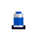    | Coolant         | Automatically used if you overheat -- saves you from overheating |
| 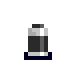    | Grenade         | Adds +1 Grenade to your inventory                                |
| 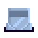        | Armor           | Wearable armor (protection varies based on price)                |
| 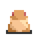     | Extra Life      | Rewards +1 Extra Lives                                           |
|    | Max HP Potion   | Increases max HP by +1                                           |

<!--~~~~~~~~~~~~~~~~~~~~~~~~~~~~~~~~~~~~~~~~~~~~~~~~~~~~~~~~~~~~~~~~~-->
 
\*&emsp;\*&emsp;\*

<!--~~~~~~~~~~~~~~~~~~~~~~~~~~~~~~~~~~~~~~~~~~~~~~~~~~~~~~~~~~~~~~~~~-->

## :cyclone: Powerups <a id="powerups"/>

Grab these powerups for new abilities. These only last a limited time.

| Icon                                           | Name            | Ability                                                  |
|------------------------|-----------------------------------------|----------------------------------------------------------|
|          | Rocket Power    | Normal firepower is replaced with rockets                |
|          | Triple Shot     | Triples the number of flames for the flamethrower        |
|      | Ring O' Fire    | Ring of circling fireballs that deals damages to enemies |
|  | Root Beer Float | Invincibility plus extra hop-speed                       |

<!--~~~~~~~~~~~~~~~~~~~~~~~~~~~~~~~~~~~~~~~~~~~~~~~~~~~~~~~~~~~~~~~~~-->
 
\*&emsp;\*&emsp;\*

<!--~~~~~~~~~~~~~~~~~~~~~~~~~~~~~~~~~~~~~~~~~~~~~~~~~~~~~~~~~~~~~~~~~-->

## :cyclone: Getting Money <a id="loot"/>

Food and gems _(aka "loot")_ are valuable items worth varying amounts.
Collect these to build up your spending money. Gems are worth more than food.
Move over the item to pick it up and it'll add to your total money/loot amount _(shown in the bottom-right corner of the screen)_.

<table>
    <thead>
        <tr>
            <td colspan="3" style="text-align:center">:cherries: <strong>Food</strong></td>
            <td colspan="3" style="text-align:center">:gem: <strong>Gems</strong></td>
        </tr>
        <tr style="text-align:center">
            <td><em>Icon</em></td>
            <td><em>Name</em></td>
            <td><em>Value</em></td>
            <td><em>Icon</em></td>
            <td><em>Name</em></td>
            <td><em>Value</em></td>
        </tr>
    </thead>
    <tbody>
        <tr>
            <td></td>
            <td>Fruit</td>
            <td>+1</td>
            <td></td>
            <td>Yellow Topaz ( Small )</td>
            <td>+5</td>
        </tr>
        <tr>
            <td></td>
            <td>Corn</td>
            <td>+1</td>
            <td></td>
            <td>Green Emerald</td>
            <td>+10</td>
        </tr>
        <tr>
            <td></td>
            <td>Food Crate</td>
            <td>+3</td>
            <td></td>
            <td>Blue Aquamarine</td>
            <td>+25</td>
        </tr>
        <tr>
            <td></td>
            <td></td>
            <td></td>
            <td></td>
            <td>Red Ruby ( Large )</td>
            <td>+100</td>
        </tr>
    </tbody>
</table>

<!--~~~~~~~~~~~~~~~~~~~~~~~~~~~~~~~~~~~~~~~~~~~~~~~~~~~~~~~~~~~~~~~~~-->
 
\*&emsp;\*&emsp;\*

<!--~~~~~~~~~~~~~~~~~~~~~~~~~~~~~~~~~~~~~~~~~~~~~~~~~~~~~~~~~~~~~~~~~-->

## :cyclone: Spending Money<a id="spending-money"/>

On the world map are levels that have a "SALE" icon over them. These
are the shop levels, where you can buy cool things. Items for sale are
stored inside the money chests (chest boxes with a dollar sign). Walk up
in front of a money chest and it'll display what's inside and the amount
you can buy it for; use your primary action to confirm the purchase, and
the chest will pop open and give you the item.

Sometimes you can buy items from the merchants themselves. Walk up to
one in the same way and use primary action to initiate the dialog. They
might have something to offer!

<!--~~~~~~~~~~~~~~~~~~~~~~~~~~~~~~~~~~~~~~~~~~~~~~~~~~~~~~~~~~~~~~~~~-->
 
\*&emsp;\*&emsp;\*

<!--~~~~~~~~~~~~~~~~~~~~~~~~~~~~~~~~~~~~~~~~~~~~~~~~~~~~~~~~~~~~~~~~~-->

## :cyclone: Hostiles, Dangerous Creatures, and Hazards <a id="hostiles"/>

Watch out for these folk, they will try to hurt you!

|                                                                              |                                                                               |                                                                                    |                                                                         |
| :--------------------------------------------------------------------------: | :---------------------------------------------------------------------------: | :--------------------------------------------------------------------------------: | :---------------------------------------------------------------------: |
|  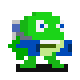 **Gunner**                 |  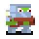 **Firestarter**   |  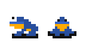 **Ground Hugger**   |  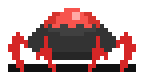 **Crawler**         |
|  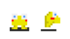 **Pygmy**                    |   **Tree Hugger**    |  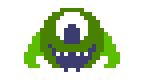 **Levitator**              |  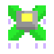 **Aerial**            |
|   **Sheep Bomb**      |  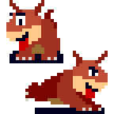 **Red Pet**            |  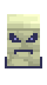 **Stone Guardian**    |  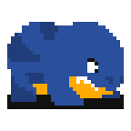 **Pachyderm**   |

<!--
### Other Hazards
 - Spikes / Electricity
 - Bouncing flames
 - Fire
-->

<!--~~~~~~~~~~~~~~~~~~~~~~~~~~~~~~~~~~~~~~~~~~~~~~~~~~~~~~~~~~~~~~~~~-->
 
\*&emsp;\*&emsp;\*

<!--~~~~~~~~~~~~~~~~~~~~~~~~~~~~~~~~~~~~~~~~~~~~~~~~~~~~~~~~~~~~~~~~~-->

## :cyclone: Experience Points and Leveling Up<a id="xp-points"/>

Right above the heat bar is the **xp bar**. As you destroy enemies,
you'll see sparkles that fly towards you. As you collect these, your xp
bar will fill up. When it fills up completely, your flamethrower will
automatically level-up to the next level and become more powerful. Level
three is the highest level you can attain from the start. Later in the
game, you can purchase upgrades that'll let you access higher levels.
Once you reach the highest level, if your xp bar fills up again, you'll
be rewarded with an extra life.

Dying will cause your xp bar to reset and your flamethower to revert to
the first level.

<!--~~~~~~~~~~~~~~~~~~~~~~~~~~~~~~~~~~~~~~~~~~~~~~~~~~~~~~~~~~~~~~~~~-->
 
\*&emsp;\*&emsp;\*

<!--~~~~~~~~~~~~~~~~~~~~~~~~~~~~~~~~~~~~~~~~~~~~~~~~~~~~~~~~~~~~~~~~~-->

## :cyclone: Sky Crystals <a id="sky-crystals"/>

| 4 Similarly Colored Crystals              | They are found in the sky levels (World 5) |
| :---------------------------------------: | ------------------------------------------ |
| 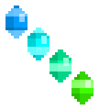  | - There are four magical crystals that power a giant shield over the land.  - It prevents teleportation from space, and this was keeping the frogs away.  - But the crystals have become unstable and inbalanced!  - You don't need to get them right-away, but you will need all 4 to access the very-end levels. |

<!--~~~~~~~~~~~~~~~~~~~~~~~~~~~~~~~~~~~~~~~~~~~~~~~~~~~~~~~~~~~~~~~~~-->
 
\*&emsp;\*&emsp;\*

<!--~~~~~~~~~~~~~~~~~~~~~~~~~~~~~~~~~~~~~~~~~~~~~~~~~~~~~~~~~~~~~~~~~-->

## :cyclone: Default Controls <a id="controls"/>

Controls can be customized within the game menu. _(Options -> Controls -> Keyboard/Controller Setup)_  
For reference, here are the default configurations.

 * ___Keyboard___

        Move...........................Arrow keys
        Strafe.........................Left Shift
        Drop Item......................D
        Shoot Flamethrower.............F / SPACE
        Charge Flamethrower............C
        Special Attack (Cannonball)....Charge until full, then press F (or SPACE) while C is still held down
        Use Shield.....................D
        Throw Grenade..................G
        Talk to NPC....................F / SPACE while close-up and facing NPC
        Toggle Switch..................F / SPACE while close-up and facing switch
        Access Game Menu...............ESC

 * ___Xbox One Controller___

        Access Game Menu...............Menu
        Move...........................Analog stick or D-pad
        Strafe.........................Left Bumper / Shoulder
        Shoot Flamethrower.............A
        Charge Flamethrower............B
        Use Shield.....................X
        Drop Item......................X
        Throw Grenade..................Y
        Talk to NPC....................A &mdash; while close-up and facing NPC
        Toggle Switch..................A &mdash; while close-up and facing switch
        Special Attack (Cannonball)....Charge until full, then press A while B is still held down

<!--~~~~~~~~~~~~~~~~~~~~~~~~~~~~~~~~~~~~~~~~~~~~~~~~~~~~~~~~~~~~~~~~~-->

<!--~~~~~~~~~~~~~~~~~~~~~~~~~~~~~~~~~~~~~~~~~~~~~~~~~~~~~~~~~~~~~~~~~-->

 * ___Xbox 360 Controller___

        Access Game Menu...............Start
        Move...........................Analog stick or D-pad
        Strafe.........................Left Bumper / Shoulder
        Shoot Flamethrower.............A
        Charge Flamethrower............B
        Drop Item......................X
        Use Shield.....................X
        Throw Grenade..................Y
        Talk to NPC....................A &mdash; while close-up and facing NPC
        Toggle Switch..................A &mdash; while close-up and facing switch
        Special Attack (Cannonball)....Charge until full, then press A while B is still held down

<!--~~~~~~~~~~~~~~~~~~~~~~~~~~~~~~~~~~~~~~~~~~~~~~~~~~~~~~~~~~~~~~~~~-->
 
\*&emsp;\*&emsp;\*

<!--~~~~~~~~~~~~~~~~~~~~~~~~~~~~~~~~~~~~~~~~~~~~~~~~~~~~~~~~~~~~~~~~~-->

## :cyclone: Custom Controller Setup <a id="controller-setup"/>

_You can configure any controller from within the game menu._

| # | Steps |
| -- | - |
| 1. | From the game menu, navigate to: **`Options` -> `Controls` -> `Controller Setup`**. |
| 2. | Set **`Layout`** to `OTHER`.                                                    |
| 3. | Navigate to any row and press `ENTER`/`RETURN` on the keyboard or `A` on the game controller. |
| 4. | You'll now see a cursor waiting for input. Press the button on the controller you'd like to map that action to. |
| 5. | Continue steps 3-4 until you're satisfied with your setup. |
| 6. | Exit the controls menu and the setup will automatically save. |

_Additional Notes_

* Use **`Next Page`** / **`Prev Page`** to navigate to other pages. _(The controls are spread across multiple pages.)_
    
* If there is no `A`, use the primary button (where `A` or `X` would normally be found)_
   
* If you first start a new game or load an existing one, any changes to the controller setup
     will be saved with that game's profile, and the setup will load automatically next time you
     load that specific game.
     
* If you change the controls before starting or loading a game, then the setup will be saved
     as the default for all new games going forward.

<!--~~~~~~~~~~~~~~~~~~~~~~~~~~~~~~~~~~~~~~~~~~~~~~~~~~~~~~~~~~~~~~~~~-->
 
\*&emsp;\*&emsp;\*

<!--~~~~~~~~~~~~~~~~~~~~~~~~~~~~~~~~~~~~~~~~~~~~~~~~~~~~~~~~~~~~~~~~~-->

# Thanks for playing!  :bomb: :penguin: :coffee: :chocolate_bar:
