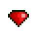

# Toad On Fire - Game Instruction Manual

## Table of Contents
1. [Getting Started](#1-getting-started)
2. [Default Controls](#2-default-controls)
3. [Objective](#3-objective)
4. [Checkpoints](#4-checkpoints)
5. [Basic Gameplay / Movement and Actions](#5-basic-gameplay--movement-and-actions)
6. [Overheating](#6-overheating)
7. [Experience Points](#7-experience-points)
8. [Money / Loot](#8-money--loot)
9. [Weapons and Upgrades](#9-weapons-and-upgrades)
10. [Items and Powerups](#10-items-and-powerups)
11. [Hostile and Dangerous Creatures](#11-hostile-and-dangerous-creatures)
12. [Sky Crystals](#12-sky-crystals)

## 1. Getting Started

 * ___After opening the game___
   * This will be the same slot that you'll use to load your game.  
   * Your progress will be saved automatically.

 * You start with nothing. As the game progresses, you'll acquire new items and abilities.

## 2. Default Controls

Controls can be customized within the game menu. _(Options -> Controls -> Keyboard/Controller Setup)_  
For reference, here are the default configurations.

 * ___Keyboard___

        Move...........................Arrow keys
        Strafe.........................Left Shift
        Drop Item......................D
        Shoot Flamethrower.............F / SPACE
        Charge Flamethrower............C
        Special Attack (Cannonball)....Charge until full, then press F (or SPACE) while C is still held down
        Use Shield.....................D
        Throw Grenade..................G
        Talk to NPC....................F / SPACE while close-up and facing NPC
        Toggle Switch..................F / SPACE while close-up and facing switch
        Access Game Menu...............ESC

 * ___Xbox One Controller___

        Access Game Menu...............Menu
        Move...........................Analog stick or D-pad
        Strafe.........................Left Bumper / Shoulder
        Shoot Flamethrower.............A
        Charge Flamethrower............B
        Use Shield.....................X
        Drop Item......................X
        Throw Grenade..................Y
        Talk to NPC....................A &mdash; while close-up and facing NPC
        Toggle Switch..................A &mdash; while close-up and facing switch
        Special Attack (Cannonball)....Charge until full, then press A while B is still held down

 * ___Xbox 360 Controller___

        Access Game Menu...............Start
        Move...........................Analog stick or D-pad
        Strafe.........................Left Bumper / Shoulder
        Shoot Flamethrower.............A
        Charge Flamethrower............B
        Drop Item......................X
        Use Shield.....................X
        Throw Grenade..................Y
        Talk to NPC....................A &mdash; while close-up and facing NPC
        Toggle Switch..................A &mdash; while close-up and facing switch
        Special Attack (Cannonball)....Charge until full, then press A while B is still held down

 * ___Other Game Controllers___

_You can configure any controller from within the game menu._

1. From the game menu, navigate to: ___OPTIONS -> CONTROLS -> CONTROLLER SETUP___.
2. Set **LAYOUT** to _"Other"_.
3. Navigate to any row and press ENTER or "A" on the game controller.  
   a.  If there is no "A", it would be where "A" is normally, or otherwise  
       it should be one of the buttons on the face of the controller.  
       Use the keyboard to help if you need.
   b.  Look for NEXT PAGE in the bottom-right of the screen to configure more actions.
4. Press the button on the controller that you'd like to map that action to.
5. Continue steps 3-4 until you're satisfied with your setup.
6. Exit the controls menu and the setup will automatically save.
   a. If you first start a new game or load an existing one, and changes to the controls will  
      be saved with that game's profile and will load automatically next time you load  
      that specific game.
   b. If you change the controls before starting or loading a game, then the setup will  
      be saved as the default for all new games going forward.

## 3. Objective

The main goal is to find and destroy the _teleporter beacons_ at the end of the stage.
They are surrounded by white-checked flags -- to help you see them better.

## 4. Checkpoints

Checkpoints are _red-colored flags_. Touching them will turn them green, indicating that
your place on the map is saved, and you will respawn there if you die.

## 5. Basic Gameplay / Movement and Actions

Use the arrow keys or the d-pad/analog-stick to move around. The primary
action is **F** / **Space bar** for the keyboard and **A** for the Xbox
360 controller. The primary action will allow you to talk to NPCs,
toggle switches, and fire your flamethrower.

Your main weapon will be the flamethrower. You can set things on fire,
destroy trees, blow up barrels, and destroy enemies with it. Be cautious
though, because the flamethrower can overheat.

___WARNING!___ Using your flamethrower continuously without breaks can  
case it to overheat. See [Overheating](#6-overheating) for more info.

## 6. Overheating

There is a bar in the bottom-left corner of the screen. This is your
**heat bar**. It tells you how hot your flamethrower is. The more you
fire, the hotter it gets and the heat bar will continue to fill up. When
you stop firing, the heat bar will drain, meaning that your flamethrower
is cooling off. If the heat bar fills up completely, you'll lose the
ability to fire for a few seconds, until the flamethrower cools down and
the heat bar completely drains.

## 7. Experience Points

Right above the heat bar is the **xp bar**. As you destroy enemies,
you'll see sparkles that fly towards you. As you collect these, your xp
bar will fill up. When it fills up completely, your flamethrower will
automatically level-up to the next level and become more powerful. Level
three is the highest level you can attain from the start. Later in the
game, you can purchase upgrades that'll let you access higher levels.
Once you reach the highest level, if your xp bar fills up again, you'll
be rewarded with an extra life.

Dying will cause your xp bar to reset and your flamethower to revert to
the first level.

## 8. Money / Loot

Toad On Fire uses food and gems for its currency. Gems are worth more
than food. Move over the item to pick it up and it'll add to your total
money/loot amount (shown in the bottom-right corner of the screen). You
need to complete the level to keep the loot that you found. You can play
the same level again to collect more loot. However, you can only take
the gems once. Any gems you complete the level with will no longer be
available when replaying the level. Food items, on the contrary,
replenish each time you play a level.

#### Loot Value
<table>
    <thead>
        <tr>
            <td colspan="3"><strong>Food</strong></td>
            <td colspan="3"><strong>Gems</strong></td>
        </tr>
        <tr>
            <td><em>Picture</em></td>
            <td><em>Name</em></td>
            <td><em>Value</em></td>
            <td><em>Picture</em></td>
            <td><em>Name</em></td>
            <td><em>Value</em></td>
        </tr>
    </thead>
    <tbody>
        <tr>
            <td></td>
            <td>Fruit</td>
            <td>1</td>
            <td></td>
            <td>Yellow Topaz ( Small )</td>
            <td>5</td>
        </tr>
        <tr>
            <td></td>
            <td>Corn</td>
            <td>1</td>
             <td></td>
            <td>Green Emerald</td>
            <td>10</td>
        </tr>
        <tr>
            <td></td>
            <td>Food Crate</td>
            <td>3</td>
            <td></td>
            <td>Blue Aquamarine</td>
            <td>25</td>
        </tr>
        <tr>
            <td></td>
            <td></td>
            <td></td>
            <td></td>
            <td>Red Ruby ( Large )</td>
            <td>100</td>
        </tr>
    </tbody>
</table>    

## 9. Weapons and Upgrades
As you play the game, you'll acquire new upgrades and abilities.
However, some upgrades and abilities must be purchased. So collect as
much loot as you can so you can afford it when the time comes. Upgrades
are found in shops. Shops are levels that have the dollar-sign icon on
the world map. You can talk to NPCs to purchase items. Other items can
be found locked in chests that can only be opened if you have enough
money. The amount will be displayed to you when you are close-up and
facing the chest.

## 10. Items and Powerups

### Heart
### Health Pack
### Coolant
### Grenade
### Armor
### Extra Life
### Max HP Potion
### Rocket Power
### Triple-Spread
### Ring of Fire
### Root Beer Float

## 11. Hostile and Dangerous Creatures

### Grunt

<table>
    <tbody>
        <tr>
            <td rowspan="4">  </td>
            <td><strong> Hostile </strong></td><td> Yes  
        </tr>
        <tr>
            <td><strong> Actions </strong></td><td> Pike Stab <em>( light damage )</em> </td>
        </tr>
        <tr>
            <td><strong> HP </strong></td><td> &#9646;&#9646;&#9646; </td>
        </tr>
        <tr>
            <td><strong> Comments </strong></td>
            <td>
                Grunts are militia. Having little-to-no formal training 
                training, they don't pose much of a threat in small numbers, and must get close 
                before they can employ the use of their melee weapon.
            </td>
        </tr>
    </tbody>
</table>

### Plasma Frog

<table>
    <tbody>
        <tr>
            <td rowspan="4">  </td>
            <td><strong> Hostile </strong></td><td> Yes  
        </tr>
        <tr>
            <td><strong> Actions </strong></td><td> Plasma Pistol <em>( light damage )</em> </td>
        </tr>
        <tr>
            <td><strong> HP </strong></td><td> &#9646;&#9646;&#9646; </td>
        </tr>
        <tr>
            <td><strong> Comments </strong></td>
            <td>
                Plasma frogs are trained in firearms and close-quarters combat.
            </td>
        </tr>
    </tbody>
</table>

### Blaze Frog

<table>
    <tbody>
        <tr>
            <td rowspan="4">  </td>
            <td><strong> Hostile </strong></td><td> Yes  
        </tr>
        <tr>
            <td><strong> Actions </strong></td><td> Flamethrower <em>( light damage - rapid fire )</em> </td>
        </tr>
        <tr>
            <td><strong> HP </strong></td><td> &#9646;&#9646;&#9646;&#9646;&#9646;&#9646;&#9646;&#9646;&#9646;&#9646;&#9646;&#9646; </td>
        </tr>
        <tr>
            <td><strong> Comments </strong></td>
            <td>
                Firestarters dual wield a pair of flame cannons to unleash a hellish blaze.
                They are much tougher than marauders and looters, and so are likely to
                strike back before they are dispatched.
            </td>
        </tr>
    </tbody>
</table>

### Levitator

<table>
    <tbody>
        <tr>
            <td rowspan="4">  </td>
            <td><strong> Hostile </strong></td><td> Yes  
        </tr>
        <tr>
            <td><strong> Actions </strong></td><td> Energy Bolt <em>( light damage )</em> </td>
        </tr>
        <tr>
            <td><strong> HP </strong></td><td> &#9646;&#9646;&#9646;&#9646;&#9646;&#9646;&#9646;&#9646;&#9646;&#9646;&#9646;&#9646;&#9646;&#9646;&#9646; </td>
        </tr>
        <tr>
            <td><strong> Comments </strong></td>
            <td>
                Lorem ipsum dolor sit amet, consectetur adipiscing elit. Cras vel sapien ullamcorper,
                malesuada lorem sed, faucibus nibh. Aenean malesuada, turpis quis eleifend malesuada,
                sem odio. 
            </td>
        </tr>
    </tbody>
</table>

### Tree Hugger

<table>
    <tbody>
        <tr>
            <td rowspan="4">  </td>
            <td><strong> Hostile </strong></td><td> No  
        </tr>
        <tr>
            <td><strong> Actions </strong></td><td> Avoids danger </td>
        </tr>
        <tr>
            <td><strong> HP </strong></td><td> &#9646;&#9646;&#9646;&#9646;&#9646;&#9646;&#9646;&#9646;&#9646;&#9646;&#9646;&#9646;&#9646;&#9646;&#9646; </td>
        </tr>
        <tr>
            <td><strong> Comments </strong></td>
            <td>
                Lorem ipsum dolor sit amet, consectetur adipiscing elit. Cras vel sapien ullamcorper,
                malesuada lorem sed, faucibus nibh. Aenean malesuada, turpis quis eleifend malesuada,
                sem odio. 
            </td>
        </tr>
    </tbody>
</table>

### Leap Frog

<table>
    <tbody>
        <tr>
            <td rowspan="4">  </td>
            <td><strong> Hostile </strong></td><td> Yes  
        </tr>
        <tr>
            <td><strong> Actions </strong></td><td> Leaps toward playrer. </td>
        </tr>
        <tr>
            <td><strong> HP </strong></td><td> &#9646;&#9646;&#9646;&#9646;&#9646;&#9646;&#9646;&#9646;&#9646;&#9646;&#9646;&#9646;&#9646;&#9646;&#9646; </td>
        </tr>
        <tr>
            <td><strong> Comments </strong></td>
            <td>
                Lorem ipsum dolor sit amet, consectetur adipiscing elit. Cras vel sapien ullamcorper,
                malesuada lorem sed, faucibus nibh. Aenean malesuada, turpis quis eleifend malesuada,
                sem odio. 
            </td>
        </tr>
    </tbody>
</table>

### Pygmy

<table>
    <tbody>
        <tr>
            <td rowspan="4">  </td>
            <td><strong> Hostile </strong></td><td> Yes  
        </tr>
        <tr>
            <td><strong> Actions </strong></td><td> Toxic Bite <em>( light damage )</em> </td>
        </tr>
        <tr>
            <td><strong> HP </strong></td><td> &#9646;&#9646;&#9646;&#9646;&#9646;&#9646;&#9646;&#9646;&#9646;&#9646;&#9646;&#9646;&#9646;&#9646;&#9646; </td>
        </tr>
        <tr>
            <td><strong> Comments </strong></td>
            <td>
                Lorem ipsum dolor sit amet, consectetur adipiscing elit. Cras vel sapien ullamcorper,
                malesuada lorem sed, faucibus nibh. Aenean malesuada, turpis quis eleifend malesuada,
                sem odio. 
            </td>
        </tr>
    </tbody>
</table>

### Sheep Bomb

<table>
    <tbody>
        <tr>
            <td rowspan="4">  </td>
            <td><strong> Hostile </strong></td><td> Yes  
        </tr>
        <tr>
            <td><strong> Actions </strong></td><td> Proximity Bomb <em>( light damage )</em> </td>
        </tr>
        <tr>
            <td><strong> HP </strong></td><td> &#9646;&#9646;&#9646;&#9646;&#9646;&#9646;&#9646;&#9646;&#9646;&#9646;&#9646;&#9646;&#9646;&#9646;&#9646; </td>
        </tr>
        <tr>
            <td><strong> Comments </strong></td>
            <td>
                Lorem ipsum dolor sit amet, consectetur adipiscing elit. Cras vel sapien ullamcorper,
                malesuada lorem sed, faucibus nibh. Aenean malesuada, turpis quis eleifend malesuada,
                sem odio. 
            </td>
        </tr>
    </tbody>
</table>

### Pachyderm

### Newt

### Hover Crystal

### Aerial Drone

### Crawler

### Sentry Cannon

### Mosquitos and Bees

### Other Hazards
Spikes / Electricity

### 12. Sky Crystals
