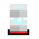
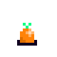
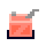
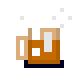

# Toad On Fire - Game Instruction Manual

## Table of Contents
1. [Introduction](#introduction)
2. [Getting Started](#getting-started)
3. [How to Play](#how-to-play)
4. [Checkpoints](#checkpoints)
5. [Special Moves](#special-moves)
6. [Overheating](#overheating)
7. [Experience Points](#xp-points)
8. [Weapons and Upgrades](#weapons-and-upgrades)
9. [Money / Loot](#loot)
10. [Useful Items](#useful-items)
11. [Powerups](#powerups)
12. [Hostiles, Dangerous Creatures, and Hazards](#hostiles)
13. [Sky Crystals](#sky-crystals)
14. [Default Controls](#controls)
15. [Controller Setup](#controller-setup)

## 1. Introduction <a id="introduction"/>

Toad On Fire is a top-down, retro-like action-adventure shooter. You play as Smokey, a toad armed with a flamethrower, and take the offensive against an invading force of hostile frogs, led by the almighty King Baxter, self-proclaimed sovereign of amphibians, who will stop at nothing to subjugate the inhabitants of Smokey's homestead and the surrounding lands. You'll join forces with a mysterious wizard, who'll provide assistance, as you push forward, intent on putting an end to King Baxter and his foray into the home of toads.

You progress through 25+ levels of varying types, ranging from pure action to puzzle-based to boss battles. The flamethrower is your primary weapon, and can dispatch enemies with volleys of fireballs, which level-up as you kick butt. A charge-action endows you with two more modes of attack: burst-fire when released; or a burst-shot that rockets you forward as a blazing toad-missile of death! After clearing a few levels, you get a shield to block projectiles, or—with some skill—deflect them back towards whence they came, using the enemy's own firepower against them. A few levels after that, you find grenades that you can collect and throw at any target of your pleasure. You'll bask in the irony of defending your homeland, all the while burning trees to the ground, smashing through boulders, and detonating volatile incendiaries.

There are also markets where you can buy worthwhile items and chat with the locals. You procure money by collecting items and gems that are found scattered throughout the game. Power-ups and secrets abound.

## 2. Getting Started <a id="getting-started"/>

### To being your journey, create a new game . . .

1. Select **`Start`** from the main menu

2. Next, select any row that shows as **`[ - New Game - ]`**
    - _You'll use this row to load your game in the future._
    - _To help you remember, saved games show a summary of details (time played, percent complete, etc.)._
    - _Your progress will be saved automatically._

## 3. How to Play <a id="how-to-play"/>

### Objective

Search for the teleporter ***beacons*** and destroy them. Every stage has _at least_ one beacon, and they might be surrounded by checkered flags _(for visibility)_.
 
| Beacon                       | Flag                                         |
| :--------------------------: | :------------------------------------------: |
|  |  |

### Movement

Use the arrow keys or the d-pad/analog-stick to move around. The primary
action is **F** / **Space bar** for the keyboard and **A** for the Xbox
360 controller. The primary action will allow you to talk to NPCs,
toggle switches, and fire your flamethrower.

### Shooting

Your main weapon is the ***flamethrower***. With this, you can fire volleys of fireballs at your enemies, trees, and barrels &mdash; setting them ablaze!
The *flamethrower* has two actions: _shoot_ and _charge_.

* _Shoot_ &mdash; this is the most basic attack. Press the primary action and Smokey will shoot fire from his flamethrower.
_(He must find one first! Keep that in mind.)_
     
* _Charge_ &mdash; you can build up a burst-shot with this action. Press and hold the charge action, and you'll notice the heatbar rising. It will quickly reach a point where it stops rising -- this is when you can release the charge action and a quick burst of flames will shoot forward.

| :warning: *Watch Out!*                                                                                                             |
| :--------------------------------------------------------------------------------------------------------------------------------- |
| :boom: _Using your flamethrower continuously without breaks can cause an overheat. See [Overheating](#overheating) for more info._ |

## 4. Checkpoints <a id="checkpoints"/>

Checkpoints save your progress for the current stage. Available checkpoints are visible as _red-colored flags_.
Touch one and it'll turn green, marking that    location as your new respawn point. The **respawn point** is the location where you'll restart from, after losing a life.

| Available                            | Used                                                 |
| :----------------------------------: | :--------------------------------------------------: |
|  |  |

| :warning: *Checkpoints don't save your progress!*                                                                                              |
| :--------------------------------------------------------------------------------------------------------------------------------------------- |
| :boom: _Checkpoint data is only used for the active stage session._  :boom: _Each time you enter a stage, you restart from the beginning._ |

## 5. Special Moves  <a id="special-moves"/>

| Name                         | How-to    |
| ---------------------------- | --------- |
| *Cannonball*                 | Charge the flamethrower to max, then press fire while still holding down the charge action. |
| *Shield Attack*              | While moving forward, press the shield action, and Smokey will slide to a stop, shield in-hand. Anything in the shield's way will take damage. Cannisters will bounce. |
| *Cannonball + Shield Attack* | Begin a cannonball and &mdash; while still rolling through the air &mdash; press the shield action. |

## 6. Overheating <a id="overheating"/>

There is a bar in the bottom-left corner of the screen. This is your
**heat bar**. It tells you how hot your flamethrower is. The more you
fire, the hotter it gets and the heat bar will continue to fill up. When
you stop firing, the heat bar will drain, meaning that your flamethrower
is cooling off. If the heat bar fills up completely, you'll lose the
ability to fire for a few seconds, until the flamethrower cools down and
the heat bar completely drains.

## 7. Experience Points <a id="xp-points"/>

Right above the heat bar is the **xp bar**. As you destroy enemies,
you'll see sparkles that fly towards you. As you collect these, your xp
bar will fill up. When it fills up completely, your flamethrower will
automatically level-up to the next level and become more powerful. Level
three is the highest level you can attain from the start. Later in the
game, you can purchase upgrades that'll let you access higher levels.
Once you reach the highest level, if your xp bar fills up again, you'll
be rewarded with an extra life.

Dying will cause your xp bar to reset and your flamethower to revert to
the first level.

## 8. Weapons and Upgrades <a id="weapons-and-upgrades"/>
As you play the game, you'll acquire new upgrades and abilities.
However, some upgrades and abilities must be purchased. So collect as
much loot as you can so you can afford it when the time comes. Upgrades
are found in shops. Shops are levels that have the dollar-sign icon on
the world map. You can talk to NPCs to purchase items. Other items can
be found locked in chests that can only be opened if you have enough
money. The amount will be displayed to you when you are close-up and
facing the chest.

## 9. Money / Loot <a id="loot"/>

Toad On Fire uses food and gems for its currency. Gems are worth more
than food. Move over the item to pick it up and it'll add to your total
money/loot amount (shown in the bottom-right corner of the screen). You
need to complete the level to keep the loot that you found. You can play
the same level again to collect more loot. However, you can only take
the gems once. Any gems you complete the level with will no longer be
available when replaying the level. Food items, on the contrary,
replenish each time you play a level.

###  Loot Value
<table>
    <thead>
        <tr>
            <td colspan="3"><strong>Food</strong></td>
            <td colspan="3"><strong>Gems</strong></td>
        </tr>
        <tr>
            <td><em>Picture</em></td>
            <td><em>Name</em></td>
            <td><em>Value</em></td>
            <td><em>Picture</em></td>
            <td><em>Name</em></td>
            <td><em>Value</em></td>
        </tr>
    </thead>
    <tbody>
        <tr>
            <td></td>
            <td>Fruit</td>
            <td>1</td>
            <td></td>
            <td>Yellow Topaz ( Small )</td>
            <td>5</td>
        </tr>
        <tr>
            <td></td>
            <td>Corn</td>
            <td>1</td>
             <td></td>
            <td>Green Emerald</td>
            <td>10</td>
        </tr>
        <tr>
            <td></td>
            <td>Food Crate</td>
            <td>3</td>
            <td></td>
            <td>Blue Aquamarine</td>
            <td>25</td>
        </tr>
        <tr>
            <td></td>
            <td></td>
            <td></td>
            <td></td>
            <td>Red Ruby ( Large )</td>
            <td>100</td>
        </tr>
    </tbody>
</table>    

## 10. Useful Items <a id="useful-items"/>

| Name            | Image                                          | Ability                                                                |
|-----------------|------------------------------------------------|------------------------------------------------------------------------|
| Heart           |                      | Adds +1 HP (one whole heart) to health bar                             |
| Health Pack     |               | Restores HP to max                                                     |
| Coolant         |                  | Automatically used if you overheatSaves you from overheating           |
| Grenade         |                  | Adds +1 Grenade to your inventory                                      |
| Armor           |                      | Wearable armor (protection varies based on price)                      |
| Extra Life      |            | Rewards +1 Extra Lives                                                 |
| Max HP Potion   |                 | Increases max HP by +1                                                 |

## 11. Powerups <a id="powerups"/>

| Name            | Image                                          | Ability                                                                |
|-----------------|------------------------------------------------|------------------------------------------------------------------------|
| Rocket Power    |          | _Time Limit_ \ Normal firepower is replaced with rockets                |
| Triple-Shot     |          | _Time Limit_ Triples the number of flames for the flamethrower        |
| Ring O' Fire    |      | _Time Limit_ Ring of circling fireballs that deals damages to enemies |
| Root Beer Float |  | Time Limit ~ Invincibility plus extra hop-speed                       |

## 12. Hostiles, Dangerous Creatures, and Hazards <a id="hostiles"/>

Watch out for these folk, they will try to hurt you!

|                                                            |                                                               |                                                                    |
| :--------------------------------------------------------: | :-----------------------------------------------------------: | :-----------------------------------------: |
|   **Gunner**            |   **Firestarter**   |   **Ground Hugger**   |
| | | |
|   **Levitator**        |   **Tree Hugger**   |   **Pygmy**                 |
| | | |
|   **Sheep Bomb**   |   **Aerial**                  |   **Crawler**                |
| | | |

<!--
### Pachyderm
### Red Pet
### Hover Crystal
### Sentry Cannon
### Mosquitos and Bees
### Other Hazards
 - Spikes / Electricity
 - Bouncing flames
 - Fire
-->

### 13. Sky Crystals <a id="sky-crystals"/>

There are four special crystal that power the shield that protects the land from teleportation. Collect all four to make it all the way to the very end.

## 14. Default Controls <a id="controls"/>

Controls can be customized within the game menu. _(Options -> Controls -> Keyboard/Controller Setup)_  
For reference, here are the default configurations.

 * ___Keyboard___

        Move...........................Arrow keys
        Strafe.........................Left Shift
        Drop Item......................D
        Shoot Flamethrower.............F / SPACE
        Charge Flamethrower............C
        Special Attack (Cannonball)....Charge until full, then press F (or SPACE) while C is still held down
        Use Shield.....................D
        Throw Grenade..................G
        Talk to NPC....................F / SPACE while close-up and facing NPC
        Toggle Switch..................F / SPACE while close-up and facing switch
        Access Game Menu...............ESC

 * ___Xbox One Controller___

        Access Game Menu...............Menu
        Move...........................Analog stick or D-pad
        Strafe.........................Left Bumper / Shoulder
        Shoot Flamethrower.............A
        Charge Flamethrower............B
        Use Shield.....................X
        Drop Item......................X
        Throw Grenade..................Y
        Talk to NPC....................A &mdash; while close-up and facing NPC
        Toggle Switch..................A &mdash; while close-up and facing switch
        Special Attack (Cannonball)....Charge until full, then press A while B is still held down

 * ___Xbox 360 Controller___

        Access Game Menu...............Start
        Move...........................Analog stick or D-pad
        Strafe.........................Left Bumper / Shoulder
        Shoot Flamethrower.............A
        Charge Flamethrower............B
        Drop Item......................X
        Use Shield.....................X
        Throw Grenade..................Y
        Talk to NPC....................A &mdash; while close-up and facing NPC
        Toggle Switch..................A &mdash; while close-up and facing switch
        Special Attack (Cannonball)....Charge until full, then press A while B is still held down

## 15. Custom Controller Setup <a id="#controller-setup"/>

_You can configure any controller from within the game menu._

| # | Steps |
| -- | - |
| 1. | From the game menu, navigate to: **`Options` -> `Controls` -> `Controller Setup`**. |
| 2. | Set **`Layout`** to `OTHER`.                                                    |
| 3. | Navigate to any row and press `ENTER`/`RETURN` on the keyboard or `A` on the game controller. |
| 4. | You'll now see a cursor waiting for input. Press the button on the controller you'd like to map that action to. |
| 5. | Continue steps 3-4 until you're satisfied with your setup. |
| 6. | Exit the controls menu and the setup will automatically save. |

_Additional Notes_

* Use **`Next Page`** / **`Prev Page`** to navigate to other pages. _(The controls are spread across multiple pages.)_
    
* If there is no `A`, use the primary button (where `A` or `X` would normally be found)_
   
* If you first start a new game or load an existing one, any changes to the controller setup
     will be saved with that game's profile, and the setup will load automatically next time you
     load that specific game.
     
* If you change the controls before starting or loading a game, then the setup will be saved
     as the default for all new games going forward.
